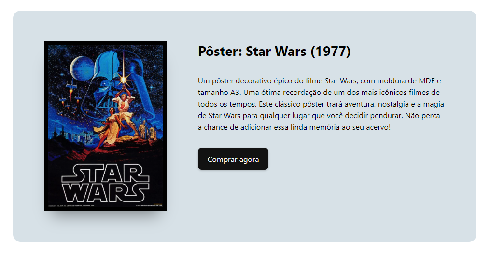

#### PROFESSOR: EVERSON SOUSA | TURMA: 2º EM DESENVOLVIMENTO DE SISTEMAS

DATA DE ENTREGA: 25/OUT | DATA DE CORREÇÃO: 30/OUT
# PROJETO 2 – CRIANDO UM COMPONENTE CARD

## Ex: Em um novo projeto React, crie um componente chamado “Card”. O componente deverá ser criado em um arquivo separado do “App.jsx” e deverá ser estilizado de acordo com a imagem abaixo. Lembre-se das organização de pastas, crie uma pasta chamada "components", e outra pasta com o nome do componente. Na pasta, deverá ter o arquivo "index.jsx".

Link da imagem a ser utilizada: <a href="https://i.pinimg.com/originals/ba/94/64/ba9464145eba8762f6286a3c8387c951.jpg" target="_blank">clique aqui</a>

Obs.: você pode usar a imagem e o texto que preferir, use sua criatividade 🙂

Página a ser reproduzida:

Boas práticas! :call_me_hand:
